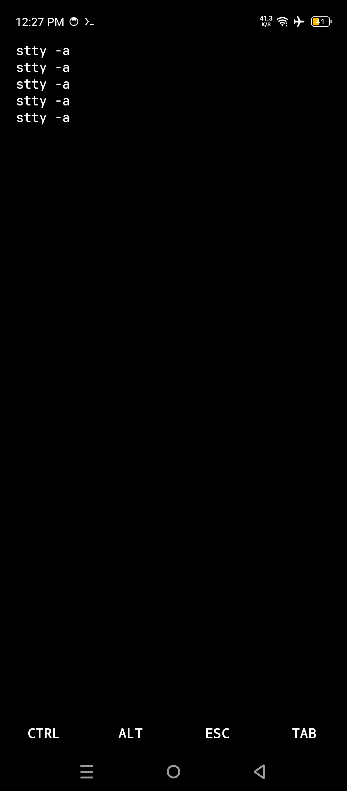

# Ravix Terminal

> **Warning:** This app is under active development and may contain bugs or unfinished features.

## Features

- [x] PseudoTerminal integration
- [x] Soft keys and key bindings
- [x] Basic terminal emulation
- [x] Input handling
- [ ] Output handling
- [ ] Cursor handling (in progress)
- [ ] ANSI sequence support (in progress)
- [ ] Process management (in progress)
- [ ] Additional features (planned)

## Screenshot



## Library Support (Coming Soon)

Ravix Terminal will soon be available as an Android library.  
This will allow developers to integrate it directly into their apps with minimal setup.

Example usage will be as simple as:

```kotlin
val terminal = TerminalView(context).apply {
    MainLayout.addView(terminal)
}
```

That's it for integrating Ravix Terminal in Android applications. Its just minimal
setup to get started. It will have rich features that will require some additional configuration,
but the basic setup will be straightforward.

## Installation

1. Clone the repository:
2. ```bash
   git clone https://github.com/Safin987/Ravix.git
    ```
3. Open in android studio.
4. Build and run the app on an Android device or emulator.

## Continuous Integration (GitHub Actions)

This project uses **GitHub Actions** to automatically build the app on every push or pull request.  
This ensures that the project compiles correctly on every change.

- Build triggered on: `push` or `pull_request` to the `main` branch
- Runs on: latest Ubuntu environment
- Android Gradle build is executed automatically

You can find the workflow file in `.github/workflows/android-ci.yml`.

## Contributing

Contributions are welcome! Feel free to open issues or submit pull requests.

## License

This project is licensed under the MIT License. See LICENSE for details.
